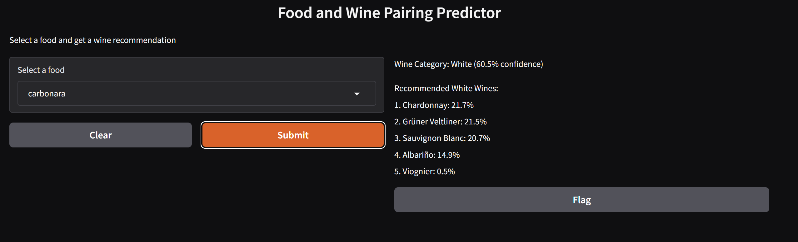

# Oblig2_DAT158

Bruker legger inn maten man skal lage og maskinlæringsmodellen kommer med anbefalinger basert på treningsdata

- Maskinlæringsmodell 
- Nettside for interaktivitet med modellen

## 👥 Collaborators
- [@h676642](https://github.com/h676642)
- [@i676609](https://github.com/i676609)
